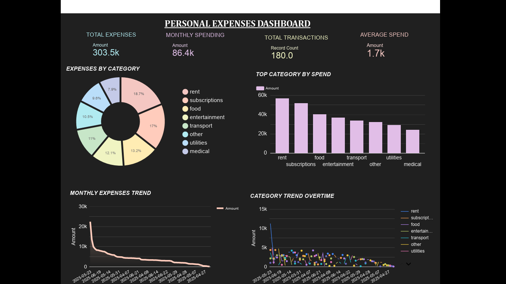
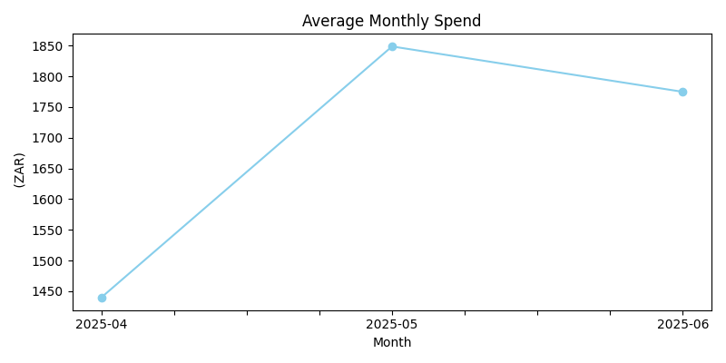
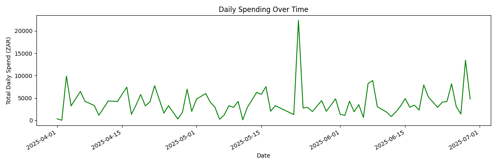
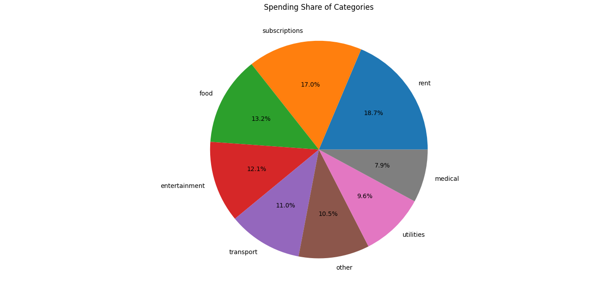

# 💸 Personal Expense Tracker & Dashboard


## **Can data change how you spend money?**
This project answers that question by building a full analytics pipeline, from raw expense data to an interactive Power BI dashboard that turns everyday spending into clear, actionable financial insights.

-----

## 🧩 The Problem

Most people have a vague sense of where their money goes. Categories like “food” or “entertainment” feel abstract until you see them visualized month over month. This project simulates the role of a **personal finance analyst**: clean the data, find the patterns, and build a dashboard that makes the story impossible to ignore.

-----

## 🎯 Key Questions Answered

- Which spending categories consume the most of my budget?
- How does my spending change month to month?
- Are there any unusual spikes or outliers in my daily expenses?
- Where can I realistically cut back?

-----

## 📊 Dashboard Preview

view Live dashboard : https://datastudio.google.com/reporting/bd918b75-cf4e-4780-86ff-747ca9442629


### Python EDA Charts





-----

## 🛠️ Tools & Technologies

|Tool                       |Purpose                                    |
|---------------------------|-------------------------------------------|
|Python (pandas, matplotlib)|Data cleaning, EDA, and visualizations     |
|Power BI                   |Interactive dashboard with slicers and KPIs|
|Tableau                    |Cross-platform visualization               |
|Git & GitHub               |Version control and portfolio hosting      |

-----

## 📁 Project Structure

```
personal-expenses-dashboard/
│
├── data/
│   ├── expenses_data.xlsx         # Raw input data
│   └── cleaned_expenses_data.csv  # Processed and ready for analysis
│
├── scripts/
│   ├── data_cleaning.py           # Handles nulls, formatting, categorization
│   └── data_analysis.py           # EDA, aggregations, and chart generation
│
├── images/      
│   ├── excel_dashboard.png           # Excel visualization screenshot
│   ├── average_monthly_spend.png
│   ├── daily_spending_overtime.png
│   └── spending_share_of_categories.png
│
├── expenses_data.pbix             # Power BI source file
└── README.md
```

-----

## 🔄 Data Pipeline

```
Raw Excel Data → Python Cleaning → CSV Export → Insights
```

**Cleaning steps performed:**

- Removed duplicate and null entries
- Standardized date formats
- Categorized transactions into consistent spending groups
- Calculated monthly and category-level aggregates

-----

## 📈 Key Findings

- **Food & dining** consistently ranked as the top spending category, accounting for the largest share of monthly expenditure
- **Monthly spending peaked** in certain months, revealing seasonal patterns worth monitoring
- **Daily spend tracking** exposed irregular spikes that would go unnoticed in monthly summaries alone
- A small number of categories drove the majority of total spend — a classic **Pareto pattern**

-----

## 💡 Business Recommendation

If this were a client engagement, I’d recommend:

1. Setting a **monthly cap** on the top 2 spending categories
1. Using the **month-over-month trend** to flag budget overruns early
1. Automating this pipeline to refresh weekly with live transaction data

-----

## 🚀 How to Run the Python Analysis

```bash
# Clone the repo
git clone https://github.com/LeighAnne17/personal-expenses-dashboard.git
cd personal-expenses-dashboard

# Install dependencies
pip install -r requirements.txt

# Run cleaning script
python scripts/data_cleaning.py

# Run analysis and generate charts
python scripts/data_analysis.py
```

To explore the Power BI dashboard, open `expenses_data.pbix` in Power BI Desktop.

-----

## 🧠 What I Learned

- How to build a **reusable data pipeline** from raw input to visual output
- Designing **multi-tool dashboards** (Python + Power BI + Tableau) for different audiences
- Translating raw numbers into **business-relevant narratives**
- Professional GitHub repo organization and documentation

-----

## 👩‍💻 About the Author

**Nonkanyiso (Leigh-Anne) Ndimande**  
Data Analyst | Aspiring Data Scientist | Finance & Cybersecurity Analytics Enthusiast

I build projects that bridge the gap between raw data and real decisions. This project reflects my interest in **personal finance analytics** and my goal of making data accessible and actionable for everyday use.

📎 [LinkedIn](https://linkedin.com/in/nonkanyiso-ndimande) · [GitHub](https://github.com/LeighAnne17) · [Email](mailto:leighndimande17@icloud.com)
